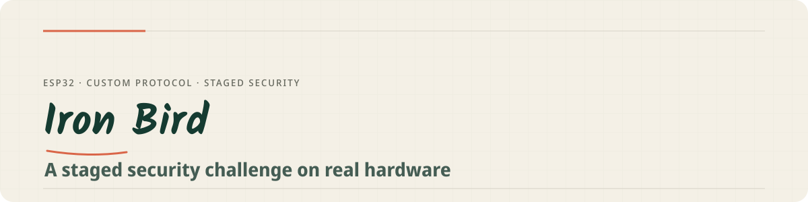

<p align="center">
  
</p>

<p align="center">
  
  
  
  
</p>

# Iron Bird

Iron Bird is a staged, story-driven security challenge running on real hardware. A custom protocol on ESP32 gates progress through multiple stages — each one requires understanding the previous layer, and each vulnerability mirrors behaviors seen in real systems. A browser-based progression tracker maps the journey live.

**Live tracker:** [iboutbaoucht.github.io/iron-bird](https://iboutbaoucht.github.io/iron-bird/)

## Why it is technically interesting

- **Staged progression** — stages unlock sequentially; the output of one challenge is the key to the next, like real reconnaissance chains.
- **Custom protocol** — a binary protocol over UDP/ESP32 with its own framing (magic bytes, sequence numbers, checksums), token tiers, and AES-protected payloads.
- **Realistic behaviors** — several challenges mirror real-world classes of bugs (e.g. memory-layout over-read à la Heartbleed, weak token derivation).
- **Browser tracker** — the `index.html` mapper visualizes solved stages, locks, and the path forward.

## Hardware and firmware

The firmware runs on ESP32 (`rover_ap/`, ESP-IDF, FreeRTOS):

- Wi-Fi soft-AP mode (`IRON_BIRD`), static PSK.
- UDP server on port `14550` speaking the custom request/response protocol (magic `0xFEED` / `0xBEEF`).
- Staged behaviors implemented in firmware task loops, hardening-sensitive states.

## Repository layout

| Path | Purpose |
|---|---|
| `index.html` | Browser progression tracker (GitHub Pages) |
| `rover_ap/` | ESP32 firmware (ESP-IDF C++ project) |

## Build the firmware

Requires the ESP-IDF toolchain:

```bash
git clone https://github.com/IBoutbaoucht/iron-bird.git
cd iron-bird/rover_ap
idf.py set-target esp32
idf.py build flash monitor
```

Solutions are intentionally not documented in this repository; the tracker at iboutbaoucht.github.io/iron-bird/ is the intended entry point.

---

<p align="center"><sub>MIT License · <a href="LICENSE">LICENSE</a></sub></p>
